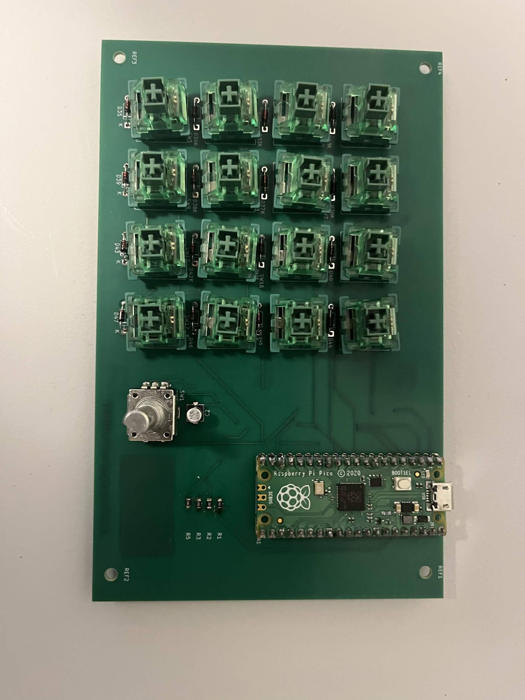

# Custom 4x4 Keyboard PCB Design

This project is a custom 4x4 mechanical keyboard PCB featuring USB HID firmware on RP2040, addressable RGB LEDs (SK6812) driven via PIO state machine, rotary encoder brightness control, and HSV color animation functions.

## Functions

### Core Functions

- 16 keys arranged in a 4 x 4 matrix pattern.

- 6 key rollover - up to 6 simultaneous keypresses registered.

- USB HID keyboard output - It can work as a plug-and-play keyboard on any computer.

- Debouncing key detection - Prevents false or double triggers from a mechanical switch bounce.

- Diode per key - Diodes were included for every key in order to prevent ghosting.

### LED Functions
- Idle RGB ripple animation - Outward ripple effect starting from center rings cycling through the entire HSV color spectrum.

- Keypress-reactive LEDS - Animation switches to keypress mode when any key is pressed, returns to idle afterwards.

- Full HSV color transition - Smooth transition between red, orange, yellow, green, cyan, blue, magenta and back.

- Ring based animation - Three concentric rings with slight phase offset creating a ripple appearance.

- Brightness control - Using a rotary encoder, smooth brightness scaling from 0-100% applied uniformly to all LEDs.

- Brightness preserved across all animation modes, whether its idle or a key is being pressed.

### Encoder Functions 

- Clockwise rotation increases brightness, counterclockwise rotation decreases brightness.

- Hardware debouncing edge detection - Prevents any skips when rotating the encoder.

### Hardware Features 

- 3.3V to 5V level shifting for LED data signal via SN74LV1T34

- Daisy-chained SK6812 MINI-E LEDs driven via RP2040 PIO state machine.

- RP2040 PIO state machine - Dedicated programmable Input/Output handles precise WS2812 timing independent of CPU timing.

- WS2812 protocol followed to ensure correct latch reset timing.

- USB powered - single cable for both HID and power communication.

## Timeline

### April 2026 - May 2026

Primarily worked on keyboard research, and drafting the schematic and pcb. Once the pcb was finished, spent some time revising the placement of parts on the board to make sure that there were no shorts or awkward placements that would make assembly difficult.

### May 2026 - June 2026

Ordered the first batch of PCBs from PCBWay, and begun soldering the first prototype, however several hardware bugs prevented the LEDs from functioning properly, causing odd behavior, and allowing only the typing to work.

### June 2026 - July 2026
Managed to get the first four LEDs of the board working, with the other 12 not functioning properly.

Extensively debugged several iterations of the board, ultimately finding that the DIN and DOUT pins on the SK6812 MINI-Es were swapped on the 5th-8th LEDs.

Because the keyboard follows a serpentine transmission of data where the signal of the next LED depends on the signal of the last LED, this broke the sequence for the rest of the LEDs.

Ultimately, the DIN/DOUT pins were finally oriented correctly, and a new batch of PCBs were ordered.

### July 2026 - August 2026

Assembled and soldered the new functioning PCBs, which finally had all 16 LEDs turn on properly. In this time period, the rest of the firmware was added, including the logic for the HSV color transition, the ring-like HSV color animation, the logic for the LED brightness dimming, etc.

In this time period, the case of the PCB was modelled using OnShape, and 3D printed, being assembled towards the end of this project, and ultimately yielding the final keyboard product. :)

## Future Improvements

- Most notably, while assembling/soldering check more frequently whether the parts assembled have the right voltage/behavior using tools such as oscilloscopes or multimeters.

- When hardware debugging, record previous symptoms of the build to ensure that the user assembling the PCB has the full picture, and might not confuse the actual cause of the bug for something else.

- Exercise more caution right before ordering PCBs, ensuring several times that the parts on the PCB have been wired correctly, even if it may pass the Design Rule Check.

